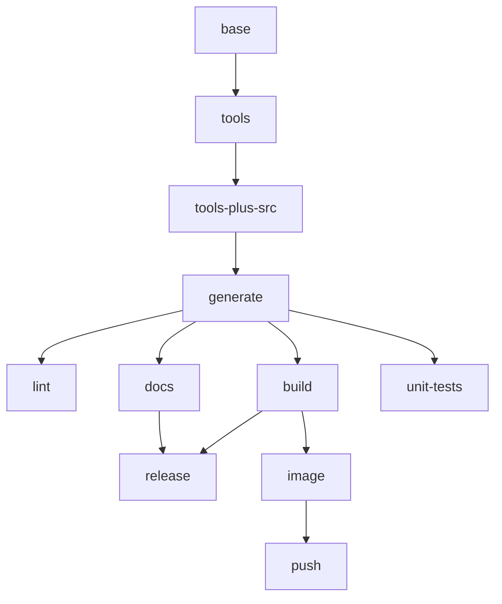
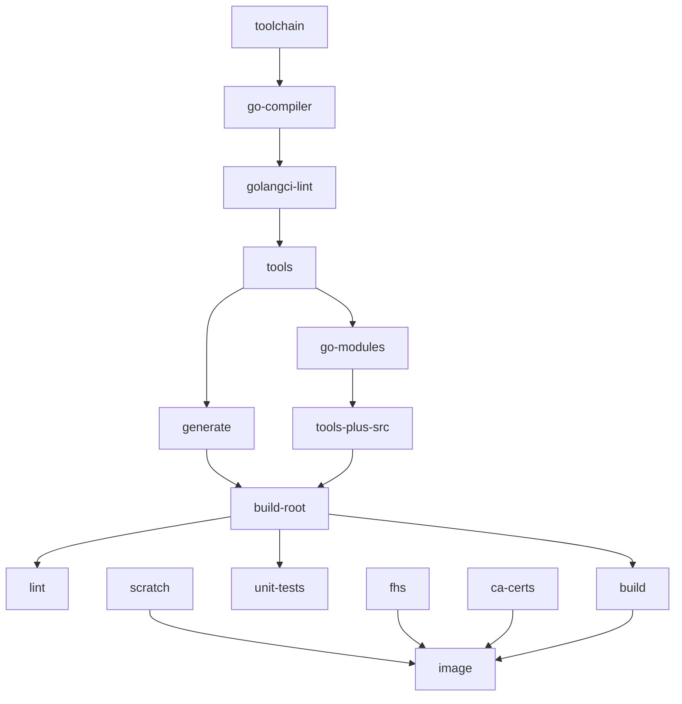

# Kres

Building from templates, inflection from source tree.

## Project Structure

```mermaid!
graph TD
  base --> tools
  tools --> tools-plus-src
  generate --> lint
  tools-plus-src --> generate
  generate --> build
  generate --> docs
  generate --> unit-tests
  docs --> release
  build --> image
  image --> push
  build --> release
```

## Dockerfile Structure

```mermaid!
graph TD
  toolchain --> go-compiler
  go-compiler --> golangci-lint
  golangci-lint --> tools
  tools --> go-modules
  go-modules --> tools-plus-src
  tools --> generate
  generate --> build-root
  tools-plus-src --> build-root
  build-root --> lint
  build-root --> build
  build-root --> unit-tests
  scratch --> image
  fhs --> image
  ca-certs --> image
  build --> image
```
