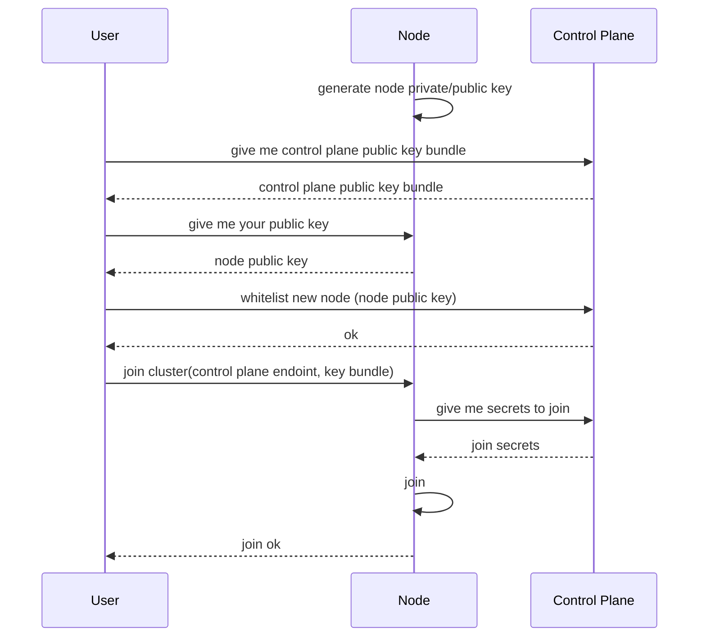

# Trustd Communication

## Node Join Flow

```mermaid
sequenceDiagram
    participant User
    participant Node
    participant Control Plane
    Node->>Node: generate node private/public key
    User->>Control Plane: give me control plane public key bundle
    Control Plane-->>User: control plane public key bundle
    User->>Node: give me your public key
    Node-->>User: node public key
    User->>Control Plane: whitelist new node (node public key)
    Control Plane-->>User: ok
    User->>Node: join cluster(control plane endoint, key bundle)
    Node->>Control Plane: give me secrets to join
    Control Plane-->>Node: join secrets
    Node->>Node: join
    Node-->>User: join ok
```
